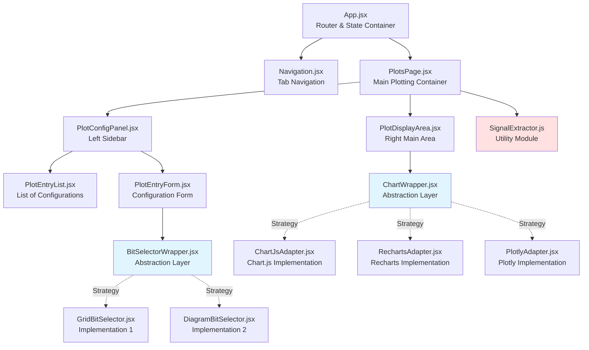
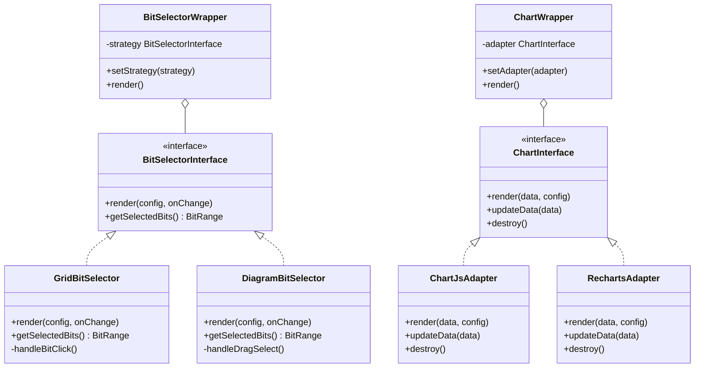
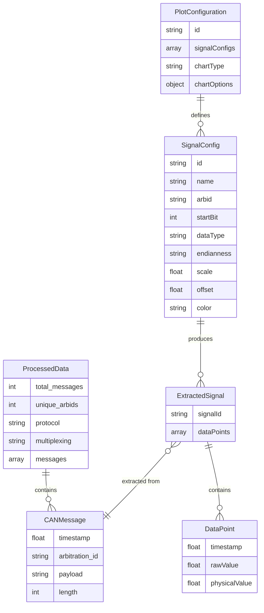
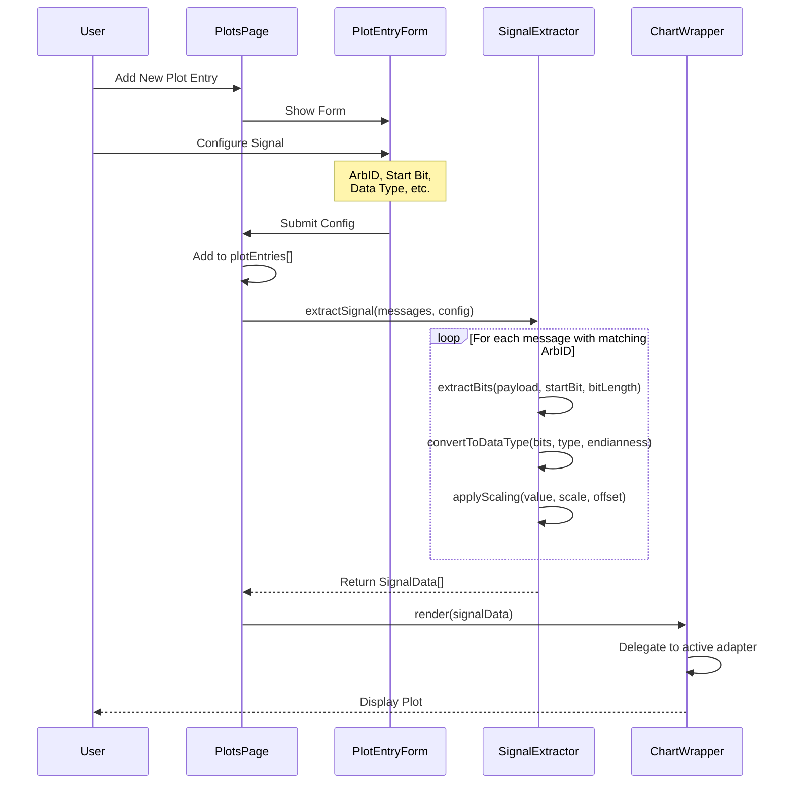
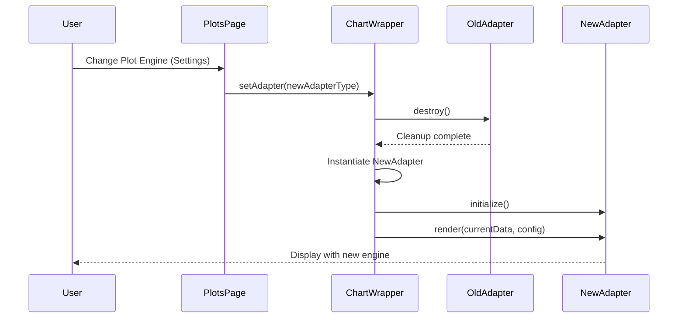
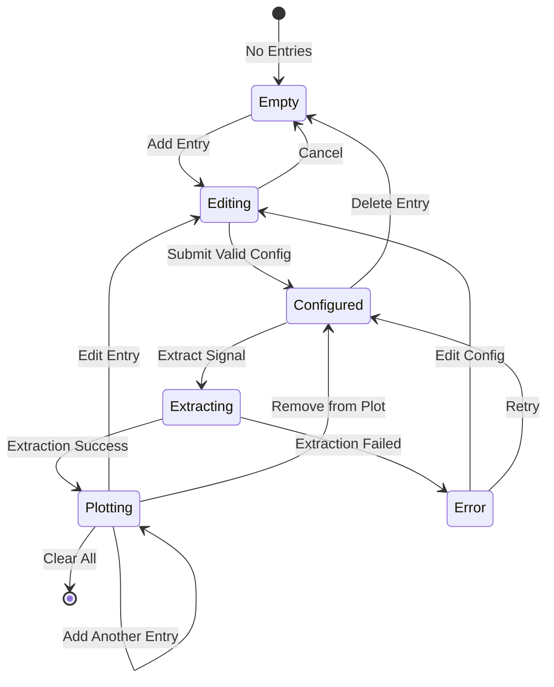
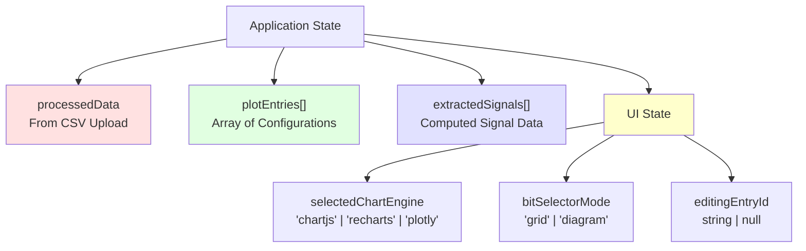
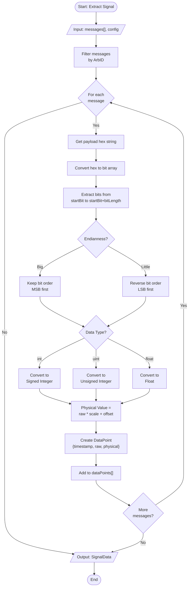
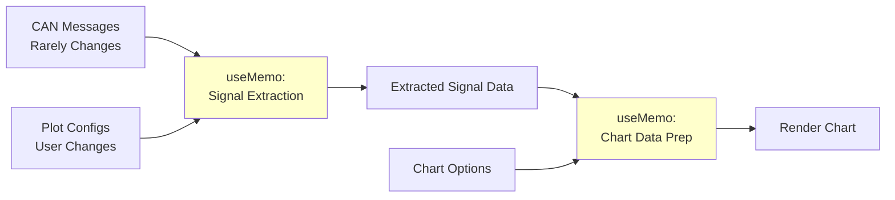

# CAN Analysis Tool - Architecture Documentation

## Phase 3: Signal Plotting & Extraction Architecture

This document defines the architectural patterns and component structure for the Signal Plotting & Extraction feature.

---

## 1. Component Architecture

### 1.1 Component Hierarchy



### 1.2 Strategy Pattern for Swappable Components



---

## 2. Data Models

### 2.1 Entity Relationship Diagram



### 2.2 Data Type Definitions

```typescript
// TypeScript-style definitions for clarity

interface PlotEntry {
  id: string;
  name: string;
  arbid: string;
  startBit: number;
  dataType: 'int8' | 'int16' | 'int24' | 'int32' | 'uint8' | 'uint16' | 'uint24' | 'uint32' | 'float16' | 'float32';
  endianness: 'big' | 'little';
  scale: number;
  offset: number;
  color?: string;
}

interface ExtractedDataPoint {
  timestamp: number;
  rawValue: number;
  physicalValue: number;
}

interface SignalData {
  signalId: string;
  signalName: string;
  dataPoints: ExtractedDataPoint[];
}

interface BitRange {
  startBit: number;
  bitLength: number;
}
```

---

## 3. Data Flow & Sequence Diagrams

### 3.1 Signal Extraction Flow



### 3.2 Plot Engine Switching Flow



---

## 4. State Management

### 4.1 Plot Entry Lifecycle State Diagram



### 4.2 Application State Structure



---

## 5. Signal Extraction Algorithm

### 5.1 Bit Extraction Flowchart



---

## 6. Component Interfaces

### 6.1 Bit Selector Interface

All bit selector implementations must conform to this interface:

```javascript
// BitSelectorInterface.js
export const BitSelectorInterface = {
  // Props received
  props: {
    payloadSize: Number,      // Total bits (e.g., 64 for 8 bytes)
    startBit: Number,         // Currently selected start bit
    bitLength: Number,        // Number of bits for data type
    onChange: Function,       // (startBit) => void
  },

  // Methods to implement
  methods: {
    render: Function,         // Render the UI
    highlightBits: Function,  // Visual feedback for selected range
  }
}
```

### 6.2 Chart Adapter Interface

All chart adapters must conform to this interface:

```javascript
// ChartAdapterInterface.js
export const ChartAdapterInterface = {
  // Methods to implement
  methods: {
    initialize: Function,     // (containerId, options) => void
    render: Function,         // (signalData[]) => void
    updateData: Function,     // (signalData[]) => void
    destroy: Function,        // () => void
    setOptions: Function,     // (options) => void
  }
}
```

---

## 7. File Structure

```
src/
├── components/
│   ├── plots/
│   │   ├── PlotsPage.jsx              # Main container
│   │   ├── PlotConfigPanel.jsx        # Left sidebar
│   │   ├── PlotDisplayArea.jsx        # Right area
│   │   ├── PlotEntryList.jsx          # List of configs
│   │   ├── PlotEntryForm.jsx          # Config form
│   │   │
│   │   ├── bitSelector/
│   │   │   ├── BitSelectorWrapper.jsx    # Strategy wrapper
│   │   │   ├── GridBitSelector.jsx       # Grid implementation
│   │   │   └── DiagramBitSelector.jsx    # Diagram implementation
│   │   │
│   │   └── charts/
│   │       ├── ChartWrapper.jsx          # Strategy wrapper
│   │       ├── ChartJsAdapter.jsx        # Chart.js adapter
│   │       ├── RechartsAdapter.jsx       # Recharts adapter
│   │       └── PlotlyAdapter.jsx         # Plotly adapter
│   │
│   └── PlotsPage.css
│
├── utils/
│   ├── signalExtractor.js            # Core extraction logic
│   ├── bitOperations.js              # Low-level bit ops
│   └── dataTypeConverters.js         # Type conversions
│
└── constants/
    └── plotTypes.js                   # Data type definitions
```

---

## 8. Design Patterns Summary

### 8.1 Strategy Pattern
- **Used for:** Bit Selector UI, Chart Rendering
- **Benefit:** Easy to swap implementations without changing core logic
- **Example:** Switch from Chart.js to Recharts with single prop change

### 8.2 Adapter Pattern
- **Used for:** Chart library integration
- **Benefit:** Unified interface for different chart libraries
- **Example:** All adapters expose same `render()`, `updateData()`, `destroy()` methods

### 8.3 Facade Pattern
- **Used for:** SignalExtractor utility
- **Benefit:** Hides complexity of bit operations, endianness, type conversion
- **Example:** Single `extractSignal()` call handles all complexity

---

## 9. Extension Points

### 9.1 Adding a New Chart Library

1. Create new adapter: `src/components/plots/charts/NewLibraryAdapter.jsx`
2. Implement `ChartAdapterInterface` methods
3. Register in `ChartWrapper.jsx`
4. Add to UI selection dropdown

### 9.2 Adding a New Bit Selector UI

1. Create new component: `src/components/plots/bitSelector/NewBitSelector.jsx`
2. Implement `BitSelectorInterface` props and methods
3. Register in `BitSelectorWrapper.jsx`
4. Add to UI selection dropdown (optional)

### 9.3 Adding New Data Types

1. Add type definition to `constants/plotTypes.js`
2. Implement conversion in `utils/dataTypeConverters.js`
3. Update `PlotEntryForm.jsx` dropdown
4. No other changes needed (extensible design)

---

## 10. Performance Considerations

### 10.1 Memoization Strategy



### 10.2 Optimization Techniques

1. **Memoize signal extraction** - Only recompute when messages or config change
2. **Lazy loading** - Load chart libraries on demand
3. **Virtual scrolling** - For large entry lists (if needed)
4. **Debounce user input** - When editing start bit or scale factors
5. **Web Workers** - For heavy extraction (future enhancement)

---

## 11. Testing Strategy

### 11.1 Unit Tests
- `signalExtractor.js` - All data types, endianness, edge cases
- `bitOperations.js` - Bit extraction, boundary conditions
- `dataTypeConverters.js` - Type conversions, overflow handling

### 11.2 Integration Tests
- Plot entry CRUD operations
- Signal extraction with real CAN data
- Chart adapter switching

### 11.3 E2E Tests
- Complete workflow: Upload → Configure → Plot → Export
- Multi-signal plotting
- UI responsiveness

---

## Revision History

| Date | Version | Changes | Author |
|------|---------|---------|--------|
| 2025-11-28 | 1.0 | Initial architecture documentation | Claude |

---

**Note:** This document should be updated whenever architectural decisions change or new patterns are introduced.
